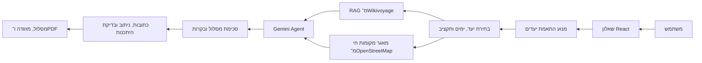

# TravelDNA — סיכום להצגת הפרויקט

## פתיחה: הבעיה שאנחנו פותרים

תכנון טיול הוא רצף של החלטות מפוזרות: לאן נוסעים, מה מתאים לאנשים שונים, אילו מקומות באמת כדאי לבקר בהם, האם הם מסתדרים באותו יום, ומה צריך לקחת. רוב הכלים מתחילים מיעד שכבר נבחר ומציגים רשימות כלליות. TravelDNA מתחיל מהמטייל ומהטיול הספציפי שהוא רוצה עכשיו, ומייצר מסלול שאפשר להבין, לבדוק ולייצא.

## מה המשתמש חווה

1. המשתמש עונה על שאלון ויזואלי בסגנון החלקה ימינה ושמאלה. הבחירות מתייחסות לטיול הנוכחי, ולא מנסות להגדיר לו "אישיות" קבועה.
2. המערכת בונה פרופיל העדפות ומציעה שלושה יעדים מתאימים מתוך 18 ערים באירופה.
3. המשתמש בוחר יעד, תאריך, מספר ימים, תקציב וקצב טיול.
4. TravelDNA מייצר מסלול יומי עם מקומות ספציפיים, שעות מוצעות, כתובות, קישורי מפה, עלויות משוערות ומידע על שעות פתיחה כאשר הוא זמין.
5. המשתמש מקבל בדיקת היתכנות, רשימת אריזה לפי מזג האוויר, ויכול לייצא את המסלול ל־PDF.

## שלב 1 — אפיון העדפות והתאמת יעד

התחלנו בהגדרת שבעה צירים מדידים: עירוניות, תרבות, חיי לילה, חברתיות, צפיפות פעילויות, אוכל ורגישות למחיר. כשרות הוגדרה כאילוץ נפרד ולא כמדד אופי.

מנוע ההתאמה משווה את פרופיל המשתמש לנתוני הערים בעזרת מרחק משוקלל ומחזיר את היעדים המתאימים ביותר. כך ההמלצה על יעד מבוססת על החלטות ברורות, ולא על תשובה כללית של מודל שפה.

## שלב 2 — בניית בסיס ידע למקומות

לכל אחת מ־18 הערים בנינו בסיס RAG ממדריכי Wikivoyage. המדריכים מחולקים לקטעים, נשמרים עם מקור, ומשמשים לחיפוש ממוקד לפני כתיבת המסלול.

במקביל, בעת בניית מסלול נאסף מאגר חי ומגוון של מועמדים מ־OpenStreetMap: מוזיאונים, גלריות, שווקים, פארקים, מסעדות ובתי קפה. המאגר מונע מצב שבו המסלול חוזר שוב ושוב לאותו אתר מפורסם או ממליץ רק על "מוזיאון" כללי.

## שלב 3 — Agent שמרכיב מסלול

Agent מבוסס Gemini מקבל את ההעדפות, התקציב, מספר הימים, בסיס ה־RAG ומאגר המועמדים. הוא מחויב להמליץ על מקום בעל שם, לגוון בין הימים ולהסביר מה עושים בכל תחנה ולמה היא מתאימה.

המסלול עובר לאחר מכן המרה לסכימה קשיחה: תאריך, שעות, סוג פעילות, תיאור ומקורות. בשלב זה אנחנו חוסמים מקומות כלליים וכפילויות. אם מופיעה המלצה כללית או מקום שכבר שובץ, המערכת מחליפה אותו במועמד מתאים מהמאגר לפני שהיא משאירה זמן חופשי.

## שלב 4 — העשרת פרטי המקום ובדיקת היגיון

לכל מקום שנבחר אנחנו מחפשים נתונים מאומתים ב־OpenStreetMap: כתובת, קואורדינטות, קישור למפה, שעות פתיחה, אתר רשמי והערכת עלות לפי סוג המקום.

לאחר מכן המערכת בודקת:

- חפיפות בין פעילויות ועומס יומי.
- שעות פתיחה כאשר פורמט השעות ניתן לפענוח בבטחה.
- זמן הליכה בין תחנות עוקבות, באמצעות מנוע ניתוב של OpenStreetMap / OSRM.
- מרחקים בלתי סבירים גם כשזמן ההליכה אינו זמין.

הציון אינו מספר שרירותי של מודל: הוא מחושב מהבעיות שאותרו ומכיסוי הנתונים. מידע שלא אומת מוצג למשתמש כפריט להשלמה, ולא כהתראה שגויה.

## שלב 5 — חוויית מוצר והפצה

הממשק נבנה ב־React וב־RTL מלא. הוא כולל מסך התקדמות ברור, פירוט תחנה לפי תחנה, כרטיסי כתובת ועלות, מסך היתכנות, תחזית ורשימת אריזה, ושמירה ל־PDF דרך חלון ההדפסה של הדפדפן.

השרת נבנה ב־FastAPI. הוא מנהל תור לבקשות תכנון, מגביל עומס לפי מבקר, ומגן על השירות כאשר ספק המודל או מקור חיצוני אינם זמינים. המערכת נפרסה ל־Railway ומחוברת ל־GitHub כך שכל עדכון עובר בנייה ופריסה.

## הארכיטקטורה בקצרה

## מקורות וטכנולוגיות

| צורך | פתרון |
|---|---|
| ממשק | React + Vite |
| שרת API | FastAPI / Python |
| מודל שפה | Gemini 3.5 Flash Lite, עם גיבוי Gemini 3.6 Flash |
| ידע תיירותי | Wikivoyage באמצעות RAG, עם ייחוס מקורות |
| מקומות, כתובות וניווט | OpenStreetMap, Nominatim ו־OSRM |
| מזג אוויר ואריזה | Open-Meteo |
| התאמת יעדים | נתוני GeoNames, Overpass / OpenStreetMap ו־Numbeo |
| פריסה | Railway + GitHub |

## החלטות הנדסיות שחשוב להדגיש

- **מקורות לפני יצירתיות:** מקום ספציפי מגיע מבסיס הידע או ממאגר מקומות חי; אין המצאת אתרים.
- **הפרדה בין הצעה לאימות:** המודל מציע מסלול, אך כתובת, שעות וניווט מתקבלים ממקורות ייעודיים.
- **שקיפות באי־ודאות:** אם אין שעות פתיחה או זמן הליכה מאומת, המשתמש רואה זאת במפורש.
- **חוויית משתמש:** השאלון קצר, ויזואלי ומותאם למובייל; התוצאה היא מסלול שימושי ולא רק פסקת המלצה.
- **עמידות:** יש תור לבקשות, מגבלות שימוש, מודל גיבוי ומסלול בסיסי אם ספק ה־AI אינו זמין.

## משפט סיכום להצגה

"TravelDNA מחבר בין התאמת יעד מבוססת נתונים, ידע תיירותי, Agent של AI ומידע גיאוגרפי חי — כדי להפוך העדפות של מטייל למסלול קונקרטי, מגוון ובר־בדיקה."

## הדגמה מומלצת

1. בחרו כמה העדפות מנוגדות בשאלון, למשל תרבות ואוכל לצד קצב רגוע.
2. הציגו את שלושת היעדים שהמערכת מציעה.
3. בחרו יעד ושלושה ימים.
4. במסלול שנוצר, הצביעו על שם המקום, הכתובת, הקישור למפה והעלות המשוערת.
5. עברו למסך בדיקת ההיתכנות והסבירו את ההבדל בין בעיה ממשית למידע שעוד לא אומת.
6. סיימו בכפתור ייצוא ל־PDF וברשימת האריזה לפי התחזית.
